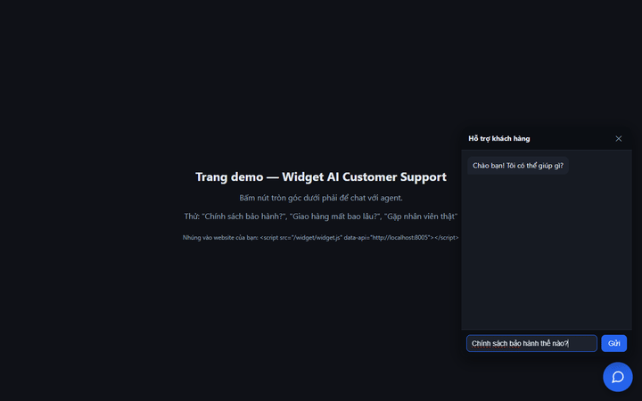
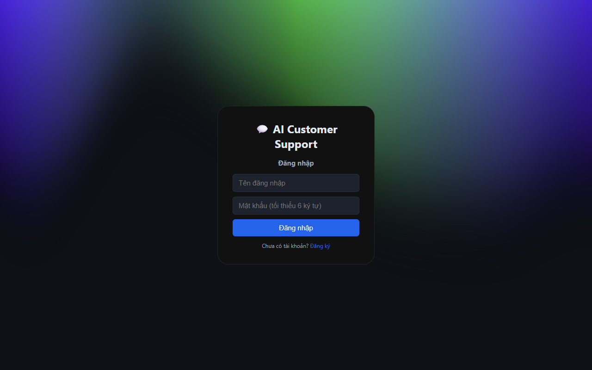
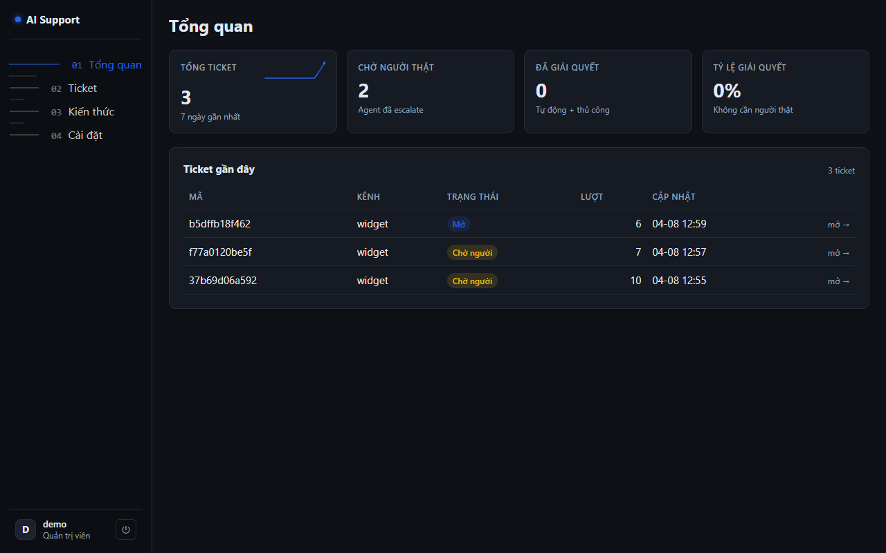
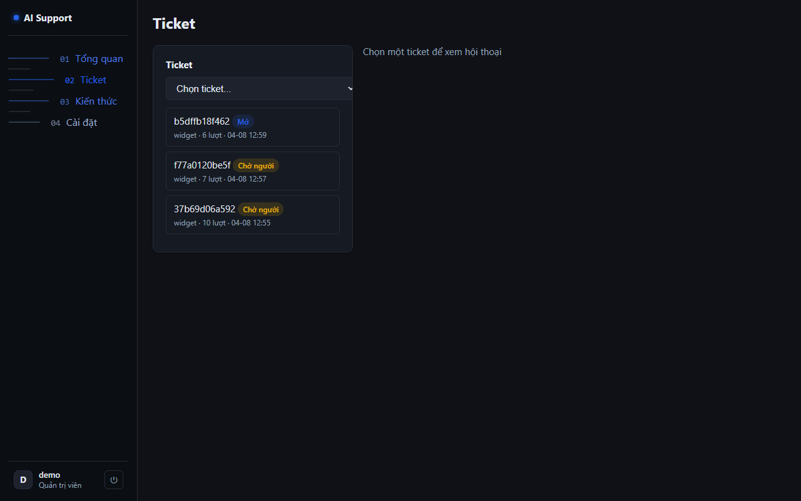
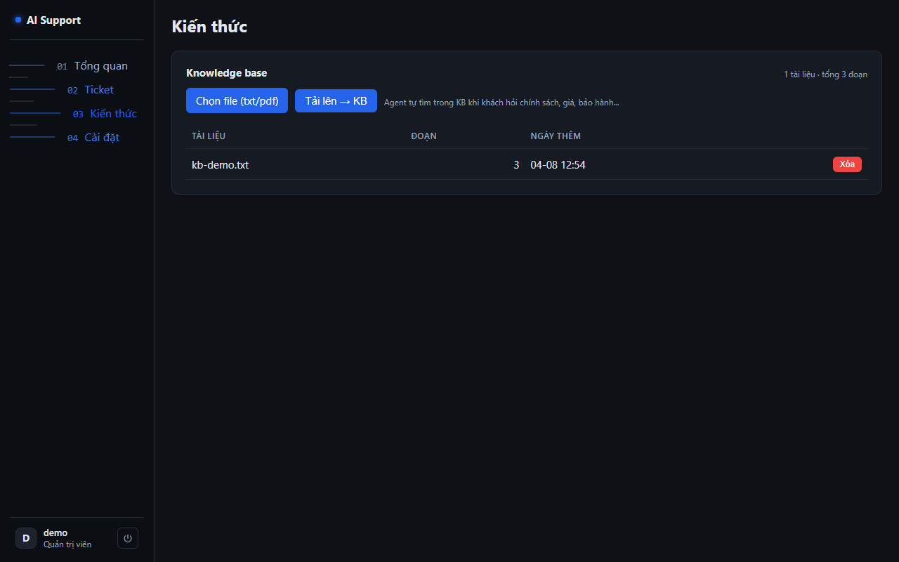
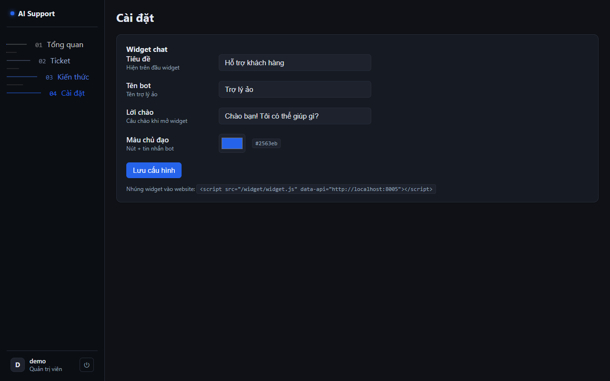
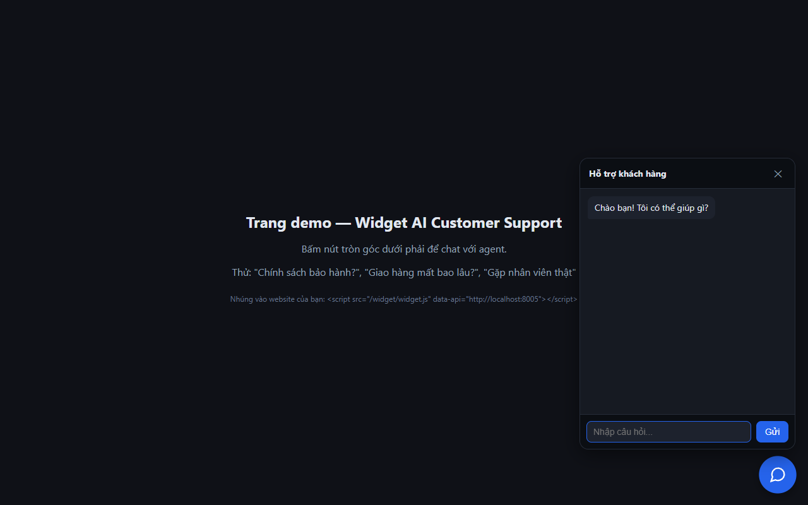

# AI Customer Support

Chatbot hỗ trợ khách hàng có agent: RAG trên knowledge base + tool-use + memory theo phiên + bàn giao người thật (escalation). Widget chat nhúng vào website, dashboard quản trị cho nhân viên.

## Tính năng

- **Agent loop tự viết** (không framework): LLM quyết định gọi công cụ, hệ thống thực thi, lặp tối đa 3 vòng rồi bàn giao an toàn.
- **RAG không cần vector DB**: chunk tài liệu + retrieval bằng token-overlap, xử lý tiếng Việt (từ + char-bigram).
- **Hard-guard chống hallucination**: câu hỏi chạm chủ đề công ty (giá, bảo hành, giao hàng...) mà LLM trả lời thẳng → hệ thống ép tra knowledge base trước, không cho trả lời từ kiến thức riêng.
- **Memory theo phiên**: cùng `session_id` → cùng ticket; lịch sử 10 lượt gần nhất đưa vào context mỗi lần hỏi.
- **Escalation**: agent tự bàn giao khi thiếu thông tin hoặc khách yêu cầu người thật; nhân viên trả lời qua dashboard → ticket quay lại quy trình.
- **Widget chat nhúng**: 1 file JS thuần, không dependency, cấu hình màu/tên qua API công khai.
- **Dashboard admin**: thống kê, quản lý ticket + trả lời, upload/duyệt knowledge base, cấu hình widget.
- **Fallback RAG thuần**: không có LLM key vẫn trả lời được từ knowledge base (không 500).

## Demo



| Đăng nhập | Dashboard | Ticket |
|---|---|---|
|  |  |  |

| Kiến thức | Cài đặt | Widget |
|---|---|---|
|  |  |  |

## Kiến trúc

```
src/
  agent/     agent loop + tool registry (search_knowledge, escalate)
  kb/        chunk tài liệu + retrieval (stdlib)
  llm/       provider OpenAI-compatible (qwencoder mặc định), mock cho test
  domain/    pydantic models: Ticket, KBEntry, WidgetConfig...
  store/     SQLite: tickets (messages = memory), kb, kb_docs, widget_config
  auth/      pbkdf2 hash + JWT (HS256)
  app.py     FastAPI: /chat (public), /kb /tickets /stats /config (admin JWT)
widget/      widget.js nhúng + trang demo
frontend/    React admin (Vite), build ra dist — server tự phục vụ
tests/       pytest: retriever, agent loop, API
```

### Agent loop

1. LLM nhận system prompt mô tả công cụ + lịch sử hội thoại.
2. Trả JSON `{"tool": "...", "args": {...}}` → hệ thống thực thi, kết quả đưa lại context.
3. Trả văn bản thường → kết thúc. Escalate hoặc hết vòng lặp → chuyển `waiting_human`.

## Chạy

```bash
pip install -r requirements.txt
python -m uvicorn src.app:app --host 0.0.0.0 --port 8005
```

- UI admin: http://localhost:8005/ — tạo tài khoản mới hoặc demo/demo1234
- Widget demo: http://localhost:8005/widget/
- API health: http://localhost:8005/health

Frontend build lại: `cd frontend && npm install && npm run build` (server tự phục vụ `frontend/dist`).

## Cấu hình (.env)

| Biến | Mặc định | Mô tả |
|---|---|---|
| `LLM_BASE_URL` | https://api.qwencoder.cloud/api/v1 | OpenAI-compatible endpoint |
| `LLM_API_KEY` | (trống) | Không có key → fallback RAG thuần |
| `LLM_MODEL` | qwen3.7-max | Model agent |
| `JWT_SECRET` | dev-secret... | Đổi khi deploy |

## Demo

```bash
python main.py
```

Đăng ký admin → upload `kb-demo.txt` → chat 3 lượt (tra cứu KB → escalate → hỏi tiếp, memory giữ ngữ cảnh) → nhân viên trả lời → thống kê.

## Test

```bash
python -m pytest tests/ -q
```

27 test: retrieval tiếng Việt, agent loop (guard KB, escalate, tool lỗi), API (auth JWT, KB, chat, ticket 404/400), regression enterprise FAQ.

## Benchmark — Real-world Retrieval on Vietnamese FAQs

### 1. Tiki Help Center (hotro.tiki.vn) — 107 bài viết thật

Data scrape qua browser automation từ Tiki Help Center. KB = chunk nội dung không index title → retriever phải khớp query→content tự nhiên. Query = tiêu đề bài (câu hỏi thật của khách VN):

| Metric | Token-overlap (baseline) | TF-IDF + stopwords | **Hybrid + e5-small** |
|---|---|---|---|
| hit@1 | 37.4% | 46.7% | **49.5%** |
| hit@3 | 55.1% | 65.4% | **68.2%** |
| hit@5 | 67.3% | 76.6% | **75.7%** |
| MRR | 0.478 | 0.569 | **0.591** |

TF-IDF khắc phục từ thường (tiki, tôi, làm, tại) lấn át token hiếm (bảo hành, đổi trả). Lần 2: thêm VN stopwords + lọc char-bigram chứa space/punct (noise như `"h "`, `"y?"`) — quan trọng với câu hỏi tự nhiên (xem mục 2). Lần 3: hybrid TF-IDF + `intfloat/multilingual-e5-small` (α=0.2, sweep trên 22 câu tự nhiên; semantic layer tùy chọn `retrieve(semantic=True)`, fallback TF-IDF nếu chưa cài sentence-transformers).

### 1b. Câu hỏi tự nhiên — 22 câu paraphrase kiểu người dùng thật

`data/tiki_queries_natural.jsonl`: 22 câu hỏi viết tay kiểu khách hàng thật (không dùng tiêu đề), GT = bài gốc theo URL. Đóng lỗ hổng benchmark cũ "query = tiêu đề quá dễ":

| Metric | TF-IDF thuần | **Hybrid + e5-small** |
|---|---|---|
| hit@1 | 36.4% | **45.5%** |
| hit@3 | 54.5% | **63.6%** |
| hit@5 | 68.2% | **72.7%** |
| MRR | 0.486 | **0.548** |

```bash
python tests/benchmark_tiki_natural.py   # chạy lại (22 câu hỏi tự nhiên, semantic=True)
python tests/benchmark_tiki_semantic.py  # sweep α để kiểm tra lại tuning
```

### 2. Controlled Enterprise FAQ — 21 bài chính sách TMĐT tự tổng hợp, 31 QA paraphrase

Định lượng mức baseline trên dataset kiểm soát, từ vựng query-content trùng khớp cao hơn thực tế:

| Metric | Kết quả |
|---|---|
| hit@1 | 64.5% |
| hit@3 | 90.3% |
| hit@5 | 93.5% |
| MRR | 0.772 |

```bash
# Tiki FAQ thật (107 queries)
python tests/benchmark_tiki.py                  # chạy lại benchmark
pytest tests/test_retrieval_regression.py       # regression: 8 câu hỏi tìm đúng article top-5
```

```bash
# Enterprise FAQ (31 queries, dataset kiểm soát)
python tests/benchmark_retrieval.py             # chạy lại benchmark
pytest tests/test_retrieval_regression.py       # regression
```

Data: `data/tiki_faq_raw.json` (KB thật từ hotro.tiki.vn), `kb/enterprise_faq.jsonl` (KB kiểm soát), `data/qa_pairs.jsonl` (QA pairs). Không sửa test data cũ.

## API tóm tắt

| Method | Path | Quyền | Mô tả |
|---|---|---|---|
| POST | `/chat` | công khai | 1 lượt hỏi-đáp, `session_id` giữ memory |
| GET | `/widget/config` | công khai | Cấu hình widget |
| POST | `/auth/register` `/auth/login` | — | Admin |
| POST | `/kb/upload` | admin | Upload txt/pdf → chunk → KB |
| GET/DELETE | `/kb/docs` `/kb/docs/{id}` | admin | Quản lý tài liệu |
| GET | `/tickets` `/tickets/{id}` | admin | Danh sách / chi tiết |
| POST | `/tickets/{id}/reply` | admin | Nhân viên trả lời |
| PATCH | `/tickets/{id}` | admin | Đổi trạng thái |
| GET | `/stats` | admin | Tổng ticket, tỷ lệ giải quyết |
| GET/PUT | `/config` | admin | Cấu hình widget |

## Nhúng widget

```html
<script src="http://localhost:8005/widget/widget.js" data-api="http://localhost:8005"></script>
```

Widget tự lấy cấu hình từ `/widget/config` (màu, tên bot, lời chào).
